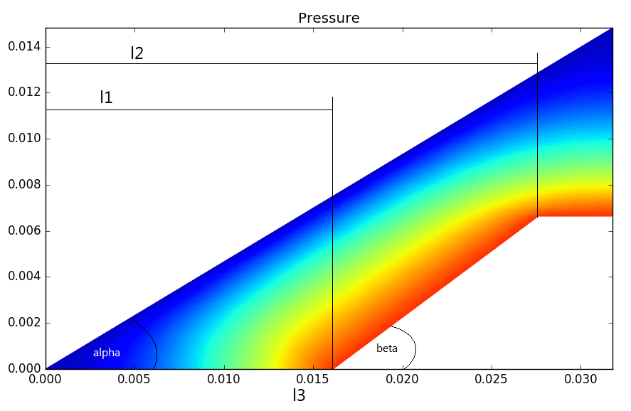
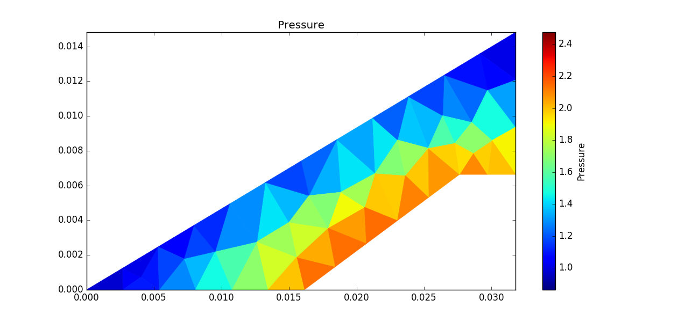
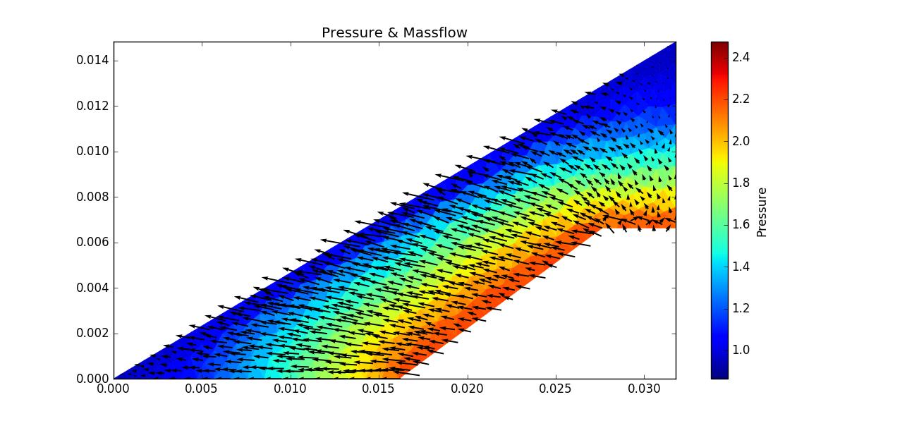
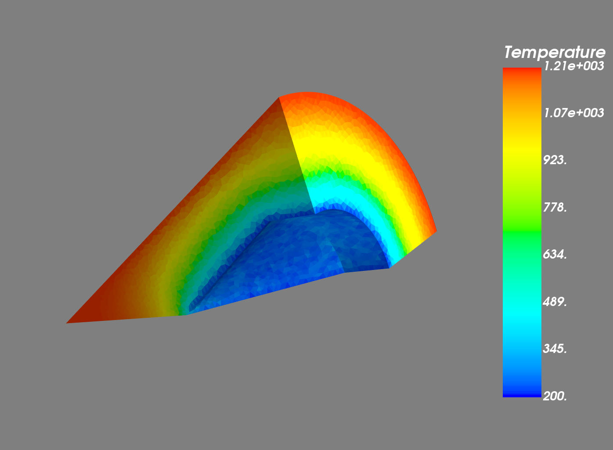

# Unstructured Grid Simulations

## Einleitung
Dieses Projekt enthält diverse Varianten von Simulationen von Wärmeleitung und Druckveränderungen in unstrukturierten Dreiecksgittern, sowohl in 2 als auch in 3 Dimensionen.

Die Dateien "visualization.py" und "materials.py" enthalten Methoden und Infoamtionen, die von allen Skripts genutzt werden.
"tri\_grid\_explicit.py" ist der Versuch einer eigenen Implementierung von Wärmeleitung nach der Finiten Volumen Methode.

Alle Dateien die mit dem Prefix "fipy_" beginnen sind Implementierungen auf Basis der FiPy Libraries, einer Bibliothek zum Lösen und Visualisieren von PDEs und ODEs.

## Gitter
In allen Sktipten (bis auf "tri\_grid\_explicit.py") werden die Gitter mit einem Tool namens Gmsh erstellt (Verwendet wurde Version 3.0.4). Gmsh erstellt 2- und 3-Dimensionale Gitter aufgrund von Textbefehlen, die einzelne Geometrien definieren und verknüpfen.
Zunächst werden die einzelnen Punkte der Geometrie definiert, dann werden diese Punkte mit Lineien verbunden und diese Linien werden dann zu einer Fläche verknüpft.
In den dreidimensionalen Fällen wird diese Fläche dann noch durch eine Rotation um pi/2 extrudiert, um einen Volumenkörper zu erhalten.

Um die Randbedingungen später im Programm festelegen zu können werden in Gmsh physikalische Kanten (oder Flächen) definiert und mit den Namen "inner" und "outer" identifiziert. Im code kann dann mit `mesh.physicalFaces["inner"]` oder `mesh.pyhsicalFaces["outer"]` auf die entsprechenden Flächen zugegriffen werden.

Die Größe der Zellen wird an den Punkten festgelegt und im Code durch die Variable `cellSize` festgelegt. Diese gibt die Zellgröße in Metern an und gilt für das gesamte Gitter.
Die Koordinaten der Punkte werden dynamisch aufgrund der Angaben über die Geometrie (Längen und Winkel) bestimmt und das Gitter dementsprechend generiert.

Die Bedeutung der Längen `l1`, `l2` und `l3` und der Winkel `alpha` und `beta` ist folgender Sizze zu entnehmen:

### Achtung
Sind in Gmsh physikalische Kanten (oder Flächen) definiert, muss auch die Fläche (oder das Volumen) als physikalisch markiert werden, da sonst keine Zellen erstellt.

## Randbedingungen
Allen Flächen mit der Bezeichnung "inner" wird der Druck `Pres` oder die Temperatur `Ti` zugewiesen, während alle Flächen mit der Bezeichnung "outer" eine Randbedingung mit dem Druck `Pamb` oder der Temperatur `Te` zugewiesen werden. Alle übrigen Zellen werden mit dem Druck `P0`oder der Temperatur `T0` initialisiert.

Die derzeitige Implementierung erlaubt nur Dirichlet-Randbedingung.

Ist für eine Fläche keine Randbedingung gegeben, wird kein Fluss (von Druck, Temperatur o.ä.) über diese Fläche angenommen.

## Materialeigenschaften
In der Datei "materials.py" sind mehrere Materialien als Python Dictionary definiert. Das Grundgerüst einer solchen Definietion befindet sich am Anfang der Datei.
In den Skripts werden diese Materialien importiert und können der Variable `material` und bei Berechnungen für Druck auch noch der Variable `fluid` zugewiesen werden. 
In den darauffolgenden Berechnungen werden dann die Werte für das Material der Probe oder des Fluids verwendet.

Die sauberste Methode neue Materialien zu verwenden, ist diese in "materials.py" zu definieren und dann aus den Skripts auf diese Definition zu referenzieren.

## Koeffizienten
Da die Materialeigenschaften oft von der Richtung abhängig sind, werden sie in der Datei "materials.py" auch dementsprechend definiert. Um FiPy diese richtungsabhängigen Werte mitzuteilen, werden sie nicht als Skalar sondern als Tensor vom 2. Rang übergeben. 

## Berechnungen
In den Skripten kommen drei Arten von Berechnungen vor: Instationär, Stationär und Stationär mit Sweeps.

Instationäre Berechnungen kommen nur in der Datei "fipy\_heat2D.py" vor. Hier kann durch die Variable `steady_state` festgelegt werden, ob die Berechnung stationär oder instationär durchgeführt werden soll.
Die dreidimensionle Berechnung der Temperatur ist aufgrund der fehlenden Möglichkeit der Visualisierung ebenfalls stationär.

Bei den Berechnungen zum Druck kommt die schwierigkeit hinzu, dass die Dichte des Fluids von dessen Druck abhängikeit. Es ist deshalb möglich, die Berechnungen mit Sweeps durchzuführen. Das bedeutet es werden einzelne Berechnungen stationär durchgeführt, bei denen immer der Druck der vorherigen Berechnung verwendet wird, um die Koeffizienten für den möchsten Durchlauf zu berechnen. Dadurch konvergiert das Ergebnis mit der Zeit zu der tatsächlichen Lösung. Versuche zeigen, dass sich die Ergebnisse nach dem 10 Sweep nicht mehr sichtlich unterscheiden.
Es kann entweder eine feste Anzahl an Sweeps angegeben werden oder man modifiziert die Bedingung der Iteration derartig, dass sie zur benötigten Konvergenzbedingung passt.

Im Fall der zweidimensionalen Druckberechnung werden ebenfalls die Massenströme für jede Zelle berechnet, nachdem das Ergebnis konvergiert ist.

## Visualisierung
FiPy selbst unterstützt mehrere Methoden der Visualisierung. Es bietet Anbindung an Matplotlib, Mayavi und diverse andere, allerdings werden nur diese beiden verwendet.
Matplotlib ist für die Visualisierung aller zweidimensionalen Daten verantwortlich, während Mayavi die dreidimensionalen Ergebnisse visulaisiert.

Im Fall der zweidimensionalen Druckberechnung werden die berechneten Masseströme noch als Pfeile eingezeichnet.

Da sich die Matplotlib Fenster immer sofort schließen, werden die Ergebnisse im Ordner "results" als PNG abgelegt und können dort im Nachhinein betrachtet werden.

Mayavi wurde über Anaconda in der Version 4.5.0 installiert.

## Ergebnisse

Druck mit 0.003m Zellgröße und 6 Sweeps

Druck mit 0.001m Zellgröße und 7 Sweeps und Massenströmen

Temperatur mit 0.0005m Zellgröße in 3D

## Zukünftige Arbeiten
Die dreidimensionale Berechnung des Druckes konvergiert nicht zum Ergebnis, sonder divergiert. Hier muss der Fehler gefunden und behoben werden.

Desweiteren ist bis jetzt keine Auswertung aus das Betrachten der Graphen möglich. Hier könnte eine Methode implementiert werden, die es erlaubt, die Werte der Lösungsvariable (`phi`) auszuwerten.

Aus der bisherigen Arbeit könnte ein allgemeines Tool zum Lösen von Differnzialgleichungen in beliebigen Meshes erstellt werden.

Die Zellgröße könnte Variabel gemacht werden, um eine hohe Auflösung nur dort einzusetzten wo man sie braucht, während das restliche Mesh eher grob ist.

## Links
Unter den folgenden Links lassen sich zusätzliche Informationen zu den entsprechenden Themen finden.

[FiPy Home](https://www.ctcms.nist.gov/fipy/index.html)

[GMSH Home](https://gmsh.info)

[Mayavi Home](http://docs.enthought.com/mayavi/mayavi/)

nonce 1
